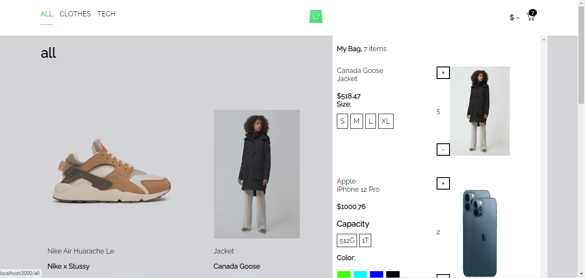

# ScandiWeb eCommerce

> An eCommerce built with React and GraphQL.

### Home Page


### Clothes Page


### Tech Page


### Currency Overlay


### Cart Overlay


### Product Detail


### Cart Page


- A User can add a product to the cart.
- A User can choose the currency that they prefer.
- A User can delete a product from the cart.
- A User will be informed if they try to add a product that's already in the cart.
- A User can view a product in more detail.

## Built With

- React
- GraphQL
- CSS

# Set Up
# Backend
```
$ git clone https://github.com/scandiweb/junior-react-endpoint.git
$ cd junior-react-endpoint
$ npm install
$ npm run build
$ npm start
```
Navigate to `http://localhost:4000/` on your browser to ensure that the GraphQl server is up and running.

# Frontend 
```
$ git clone https://github.com/emmyobonyo/emmanuel-obonyo-scandiweb-react-developer-interview.git
$ cd emmanuel-obonyo-scandiweb-react-developer-interview
$ git checkout development
$ npm install
$ npm start
```

## Authors

👤 **Emmanuel Obonyo**

- GitHub: [@emmyobonyo](https://github.com/emmyobonyo)
- LinkedIn: [Emmanuel Obonyo](https://www.linkedin.com/in/emmanuel-obonyo-3728a2200/)

## 🤝 Contributing

Contributions, issues, and feature requests are welcome!

Feel free to check the [issues page](https://github.com/emmyobonyo/emmanuel-obonyo-scandiweb-react-developer-interview/issues).

## Show your support

Give a ⭐️ if you like this project!
